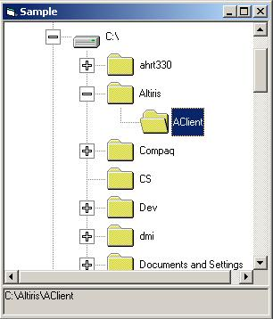



## Explorer Treeview Sample

### Description

This code shows how to load an Explorer type treeview control using the FileSystemObject. The heart of the code is modTreeview, where all the work takes place. You can drop this module into your project, reference the FileSystemObject and go. All the code is here to show you how to load the treeview control, handle clicks and get the path back. Nothing majorly spectacular but handy. It is also fast loading because it doesn't load the next "level" until the user clicks...just like windows explorer.
 
### More Info
 

             |
---                |---
**Submitted On**   |2001-08-16 10:18:46
**By**             |[Eddie Merkel](https://github.com/Planet-Source-Code/PSCIndex/blob/master/ByAuthor/eddie-merkel.md)
**Level**          |Intermediate
**User Rating**    |4.3 (13 globes from 3 users)
**Compatibility**  |VB 5\.0, VB 6\.0, VBA MS Access
**Category**       |[Files/ File Controls/ Input/ Output](https://github.com/Planet-Source-Code/PSCIndex/blob/master/ByCategory/files-file-controls-input-output__1-3.md)
**World**          |[Visual Basic](https://github.com/Planet-Source-Code/PSCIndex/blob/master/ByWorld/visual-basic.md)
**Archive File**   |[Explorer T247508162001\.zip](https://github.com/Planet-Source-Code/eddie-merkel-explorer-treeview-sample__1-26260/archive/master.zip)

